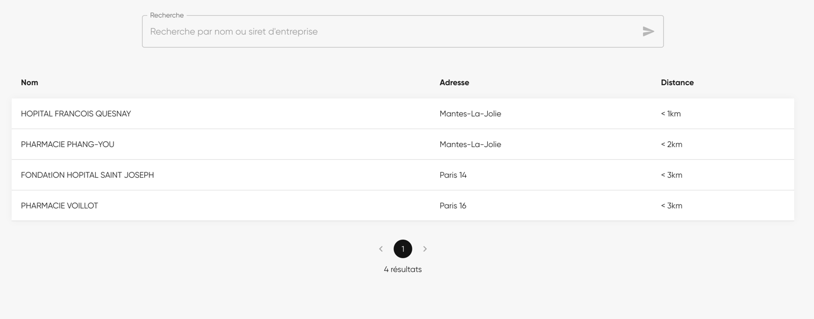

# Test technique - Backend et Frontend

## Objectif général
Le test technique comprend deux aspects : Backend et Frontend.

Le but est de créer une application fullstack qui permettra :
- d'obtenir une liste de pharmacies,
- chaque pharmacie est classée en fonction de leur distance par rapport au centre de Paris,

## Backend
Le backend de l'application doit permettre de répondre aux exigences suivantes :
- Permettre d'obtenir une liste de pharmacies.
- Permettre de supprimer une pharmacie
- Optionnel : compléter les annotations OpenApi.
- Optionnel, mais apprécié : mettre en place des tests unitaire pour la couche service.

## Frontend
La création du Frontend de l'application est libre, mais voici quelques fonctionnalités obligatoires :
- Afficher une liste de pharmacies triées par la distance par rapport à un point GPS (centre de paris). Cette information est envoyée au backend.
- Pour chaque pharmacie, afficher un bouton qui permet de supprimer la pharmacie.
- Optionnel : Utiliser la librairie https://mui.com/
- Optionnel : Responsive Design

Voici un exemple de ce que l'on peut attendre comme résultat :

## Modalités
- Vous pouvez cloner ce repository et nous envoyer le lien vers votre fork.
- Le test devra être effectué individuellement.
- La qualité du code sera évalué.